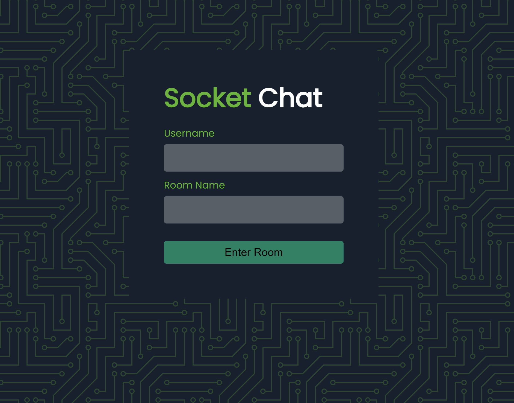

# Flask ChatApp :snake:
A real time room based chat webapp implemeted using flask socket IO, and jquery

## Screenshots :camera_flash:

### Login Page :fire:

### Chat Room Page :fire:


## Installation :rocket:

```bash 
  git clone https://github.com/Rdxmaxx/flask-chatApp.git
  cd flask-chatApp
  pipenv sync
  python app.py
```

## We can use it over WAN by forwarding our port using ngrok

 - Download ngrok for your os
  ```
  https://ngrok.com/download
  ```
- Start SocketChat 
```
python app.py
```

- Open second terminal start ngrok on same port as your Flask App
```
ngrok http 5000
```


- copy the link given by ngrok paste it in your browser and your app is ready


:warning: If you close your ngrok terminal the session will die.

## Final Product :fire:

